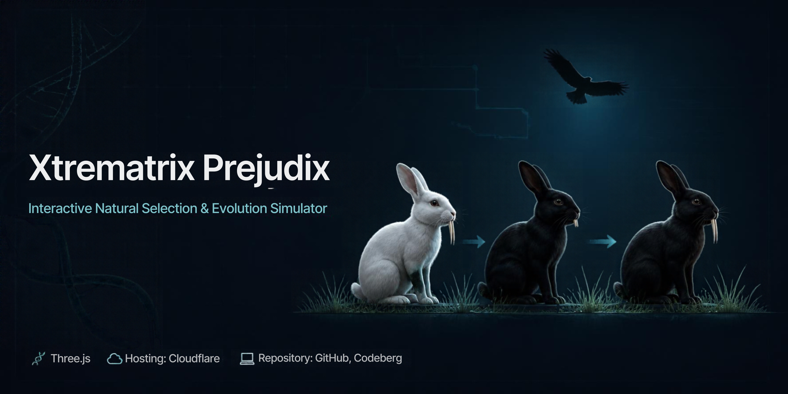

  

# 🧬 Xtrematrix Prejudix

### *Interactive Natural Selection & Evolution Simulator*

> **Xtrematrix Prejudix** is an interactive visualization exploring **biological variation**, environmental selection pressure, survival advantages, and evolutionary adaptation through simulated populations.
>
🧬 **Evolution** · 🌱 **Natural Selection** · 🐇 **Biological Variation**

**🔬 [Explore the Simulation](https://xtrematrix.stark-kodex.workers.dev)**

---

## ✦ Features

**🧬 Variation Simulation**  
Explore genetic variations and trait differences within a population.

**🦅 Selection Pressure Simulation**  
Visualize how environmental factors such as predators and resource availability influence survival.

**🐇 Adaptation Visualization**  
Observe how advantageous traits become more common through generations.

**🌱 Environmental Interaction**  
Explore the relationship between organisms, traits, and changing environments through interactive scenarios.

**🔬 Interactive Learning**  
Understand evolutionary processes through step-by-step visualization.

**🎴 Dark Interface**  
A clean, focused environment designed for scientific exploration and biology education.

---

## 🧬 Core Concepts

**Variation · Natural Selection · Selection Pressure · Adaptation · Survival Advantage · Evolutionary Change · Population Dynamics**

---

## ⚙️ Technology

**HTML · CSS · JavaScript · Three.js**

**3D Asset:** Rigged Rabbit, Eagle Model
**Repository:** GitHub & Codeberg  
**Hosting:** Cloudflare

---

## 🙏 Credits

🐇 **FourthGreen # Sketchfab**  
Rigged Rabbit Model

☁️ **Supabase**  
Asset Delivery

🤖 **OpenAI GPT Luna 5.7**  
Code Implementation & Prompt Generation

🧠 **Claude Sonnet 5.5**  
Code Architecture Generation

---

## 📜 License

Distributed under the **GNU General Public License v3.0 (GPL-3.0)**.
